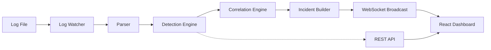

# SysLog Threat Analysis — Implementation Walkthrough

## Overview

A complete, production-grade SOC investigation platform built from scratch with a Python/FastAPI backend and React/TypeScript/TailwindCSS frontend. The system ingests syslog files, detects threats via 15 custom rules, correlates alerts into incidents, generates deterministic reasoning, and presents findings through a professional dashboard.

## Architecture



---

## Backend Modules

### Parser ([log_parser.py](file:///d:/syslog-a/backend/parser/log_parser.py))
- Auto-detects format: auth.log, syslog, Apache access, Apache error
- Named-group regex extraction with compiled patterns
- Event classification into 8 types (Authentication, Network, Firewall, etc.)
- Severity assessment based on message content and HTTP status codes

### Detection Engine ([threat_engine.py](file:///d:/syslog-a/backend/detection/threat_engine.py))
- 15 rules with MITRE ATT&CK mappings ([rules.py](file:///d:/syslog-a/backend/detection/rules.py))
- Stateful frequency tracking for brute force (5+ failures in 60s) and 404 floods (10+ in 30s)
- Pattern matching: SSH brute force, SQL injection, directory traversal, suspicious user agents, kernel panics

### Correlation Engine ([correlation_engine.py](file:///d:/syslog-a/backend/correlation/correlation_engine.py))
- 5 correlation scenarios: Brute Force, Account Compromise, Web Recon, Privilege Escalation, Repeated Service Failure
- Sliding time windows with configurable thresholds
- Builds `Incident` objects with timelines and event relationships

### Reasoning Engine ([reasoning.py](file:///d:/syslog-a/backend/analysis/reasoning.py))
- Deterministic, template-based explanations — no LLM
- Confidence scoring (0-100%) based on event count, time density, rule certainty, correlation strength
- Risk classification (LOW/MEDIUM/HIGH/CRITICAL)
- Per-incident-type recommendations

### Pipeline ([pipeline.py](file:///d:/syslog-a/backend/services/pipeline.py))
- Orchestrates: Parse → Detect → Correlate → Enrich → Broadcast
- In-memory bounded buffers (100K logs, 10K alerts, 1K incidents)
- Full-text search, severity/type/IP filtering, and pagination

---

## API Endpoints

| Method | Path | Description |
|--------|------|-------------|
| GET | `/api/stats` | Dashboard statistics |
| GET | `/api/logs` | Filtered/paginated log entries |
| GET | `/api/logs/{id}` | Log detail with triggered rules |
| GET | `/api/alerts` | All alerts (filterable by status) |
| POST | `/api/alerts/action` | Acknowledge/resolve alerts |
| GET | `/api/incidents` | Incident list |
| GET | `/api/incidents/{id}` | Full incident detail |
| POST | `/api/monitor/start` | Start file monitoring |
| POST | `/api/monitor/stop` | Stop monitoring |
| GET | `/api/files` | Available log files |
| GET | `/api/export/{fmt}` | Export JSON/CSV/PDF |
| POST | `/api/clear` | Reset all data |
| WS | `/ws` | Real-time updates |

---

## Frontend Pages

### Dashboard
- Monitor controls (file selector, start/stop)
- 5 stats cards (Total, Info, Warnings, High, Critical)
- Live log stream with severity-coded rows
- Active threats panel with MITRE ATT&CK tags
- 4 Recharts visualizations (threat distribution, log volume, severity, top IPs)
- Recent incidents list

### Log Explorer
- Full-text search across all fields
- Severity, event type, and IP filters
- Paginated table with expandable detail rows
- Raw log display, parsed fields, and triggered detection rules

### Incidents
- Sortable incident cards with severity badges and confidence
- Full detail view with:
  - Analysis & Reasoning (template-generated explanations)
  - Recommended Actions
  - Visual timeline with severity-coded dots
  - Triggered rules and MITRE ATT&CK technique tags
  - Related log entries

### Reports
- JSON (full structured report), CSV (tabular logs), PDF (formatted incident summary)

### Settings
- Configuration display and dashboard clear

---

## Verification Results

| Metric | Value |
|--------|-------|
| Auth.log lines parsed | 519 |
| Total alerts generated | 125 |
| Incidents correlated | 3 |
| Incident types | Privilege Escalation, Brute Force, Account Compromise |
| Detection rules active | 15 |
| MITRE techniques mapped | T1078, T1110, T1548, T1083, T1190, T1595 |

---

## Screenshots

### Dashboard with Charts and Active Threats


### Incident Detail with Reasoning and Timeline


### Log Explorer with Filters


---

## Running the Project

### Backend
```bash
cd backend
pip install -r requirements.txt
python generate_sample_logs.py
python -m uvicorn main:app --host 0.0.0.0 --port 8000
```

### Frontend
```bash
cd frontend
npm install
npm run dev
```

Access the dashboard at `http://localhost:5173/`
